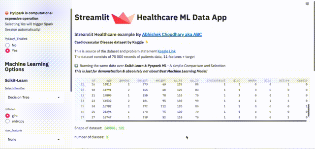

# Streamlit Healthcare Machine Learning Data App



## Objective
1. How easy is it to create a Web App using Streamlit
2. Integrating multiple #machinelearning technologies in the same app
3. Code reusability
4. Streamlit functions & feature usage
Streamlit Healthcare ML Data App is a comprehensive machine learning application developed in Python using Streamlit, pandas, NumPy, seaborn, Plotly, Matplotlib, scikit-learn, and PySpark. The application aims to analyze a cardiovascular disease dataset sourced from Kaggle, comprising 70,000 patient records with 11 features. By leveraging both Scikit Learn and PySpark ML libraries, the app provides users with a seamless comparison and selection of machine learning models for predicting cardiovascular disease risk. PySpark is mainly used in this project (with Decision Tree and Random Forest algorithms), 

## Key Features
* Interactive Interface: Explore and visualize the dataset's features, correlations, and distributions through an intuitive Streamlit interface.
* Correlation Matrix: Visualize the correlation matrix to identify relationships between different features in the dataset.
* Histograms and Plots: Gain insights into key features such as age, Body Mass Index (BMI), and Mean Arterial Pressure (MAP) through interactive histograms and scatterplots.
* Classifier Selection: Choose from a variety of classifiers via the sidebar and customize parameters to train and evaluate machine learning models.
* Model Evaluation: Evaluate the performance of each machine learning model with metrics such as accuracy, F1 score, AUC, and confusion matrix.
* Predictions: Obtain predictions on cardiovascular disease risk based on age using PySpark.
* Provide Tuning parameters in the UI 

## Testing and Continuous Integration

* Comprehensive Testing: Utilize pytest for unit tests, flake8 for code linting, isort for import sorting, black for code formatting, pylint for static analysis, and bandit for security checks.
* Dockerized Environment: Docker is used for containerization, ensuring consistency and reproducibility across different environments.
* Continuous Integration: Set up continuous integration to maintain code quality and reliability through automated testing and validation.

## Running the App

1. Clone the repository
 ```buildoutcfg
git clone https://github.com/enriquerb32/streamlit-ML-Classification-webapp.git
cd streamlit-healthcare-ml-app
``` 
2. Build and run the docker image
```buildoutcfg
docker build --tag streamlit-healthcare:1.0 .
docker run -it -p 8501:8501 streamlit-healthcare:1.0
```
3. Browse the [url](http://localhost:8501)

## Features
* Load Healthcare data from Kaggle https://www.kaggle.com/sulianova/cardiovascular-disease-dataset
* Use __scikit-learn__ ML lib to run classification.
* Provide Tuning param options in the UI 
* Provide Switch to enable __PySpark__
* Provide Pyspark MLlib options over the same data, technically one can compare 
the result between 2 seperate libraries
* Plotting using Seaborn chart

## Contributions and Future Enhancements

Contributions to this project are welcome! Feel free to fork the repository and submit pull requests for improvements or additional features. Potential enhancements include:

* Adding support for more machine learning algorithms
* Enhancing the user interface with additional visualizations and interactivity
* Integrating advanced model evaluation techniques and hyperparameter tuning, either UI-based or optimising it on the code

## License

This project is licensed under the MIT License
